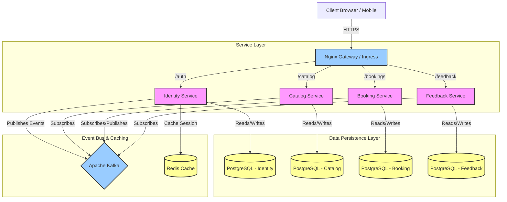
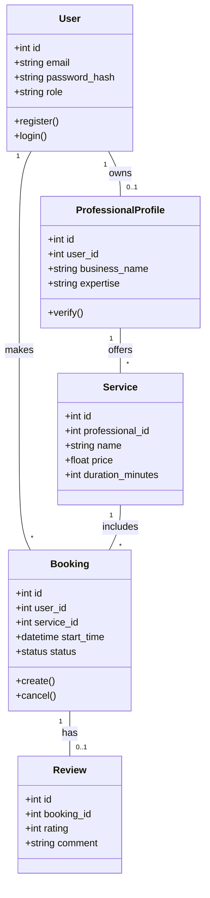

# System Architecture & UML Diagrams

## 1. High-Level Component Diagram (Microservices Architecture)
This diagram illustrates the interaction between the Frontend, API Gateway (Ingress), Microservices, and Data Infrastructure (Databases, Kafka, Redis).

## 2. Core Class Diagram (Domain Model)
This diagram represents the key entities and their relationships across the system.

